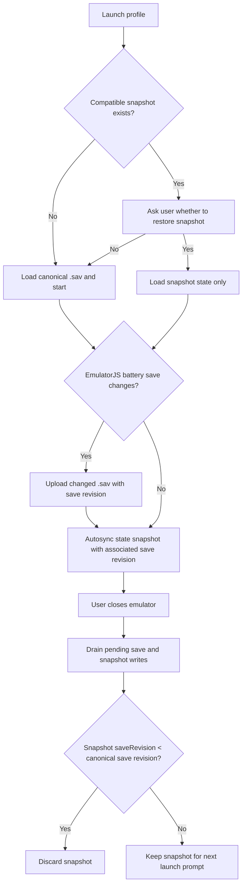

# Spec 044 — Battery saves and independent emulator snapshots

## Goal

Separate the canonical battery `.sav` from recoverable emulator snapshots. A
`.sav` is uploaded only after EmulatorJS reports that its battery-save bytes
changed. Routine recovery synchronization uploads state snapshots only. A
snapshot never writes, replaces, or deletes the canonical `.sav`.

## Lifecycle

Snapshot restore remains an explicit user decision. Declining a snapshot does
not delete it or change the canonical battery save. Loading a snapshot calls
the EmulatorJS state loader only; the application does not write snapshot
bytes to the `.sav` path.

## Revisions and close reconciliation

- The save store owns the canonical monotonically increasing `saveRevision`.
- Snapshot metadata records the canonical `saveRevision` observed when that
  state was captured. Snapshot's own `revision` remains its independent ETag
  for replacing the snapshot slot.
- Snapshot capture sends no battery-save bytes. Its `saveRevision` is the last
  acknowledged canonical save revision at the time the state was captured.
- Closing drains queued battery-save and snapshot requests, then performs a
  lease-protected snapshot reconciliation. If `snapshot.saveRevision` is
  lower than the current canonical save revision, the server deletes that
  snapshot. Equal or higher revisions retain it. If there is no canonical
  save, revision is treated as zero.
- Save uploads do not eagerly invalidate snapshots. The close reconciliation
  is the only automatic deletion rule.

## Synchronization behavior

- Remove periodic `.sav` uploads. While the game is running, the player polls
  `gameManager.saveSaveFiles()` to flush SRAM through EmulatorJS's
  `saveSaveFiles` event; this poll is save-only and does not upload snapshots.
  Upload only when the save bytes hash differs from the last acknowledged
  hash. The poll interval is at least one second and scales with SRAM size.
  Serialize uploads per player and coalesce repeated events while one upload
  is in flight.
- Periodic recovery synchronization captures and uploads `getState()` only.
  It must not call `saveSaveFiles()`, read `getSaveFile()`, or write a save.
- Manual Save state follows the same snapshot-only contract.
- On close, stop save polling and periodic snapshots, read and queue the final
  battery-save bytes, await outstanding capture/upload work, then reconcile
  the snapshot before releasing the player lease.
- A failed write is surfaced by the existing close error behavior; the server
  must not delete a prior snapshot unless the comparison has completed.

## Snapshot resource and compatibility

The existing one-slot `(profileId, gameId)` snapshot resource remains. Its
binary envelope and storage contain state bytes and metadata only; legacy
bundled `.sav` objects are ignored and cleaned up safely during replacement or
deletion. Metadata contains `saveRevision` alongside snapshot `revision`,
compatibility fields, state length/hash, and lease fence generation.

The snapshot PUT requires the current player lease and snapshot `If-Match` as
before. The new lease-protected release flow performs reconciliation before
releasing the lease, so no other player can race the comparison.

## Acceptance criteria

1. EmulatorJS battery-save change is the only automatic trigger for a
   canonical `.sav` upload; identical bytes do not create a revision.
2. Periodic and manual snapshot operations upload state only and never write
   `.sav` bytes.
3. Snapshot startup presents an explicit restore choice; declining preserves
   both canonical save and snapshot, while accepting loads state only.
4. Snapshot metadata records the canonical save revision associated with its
   captured state.
5. Close drains pending writes and deletes only snapshots older than the
   canonical save revision; equal/newer snapshots remain.
6. Existing profile/game lease fencing and optimistic snapshot revisions
   continue to reject stale clients.
